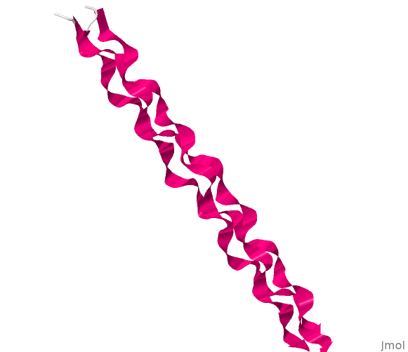
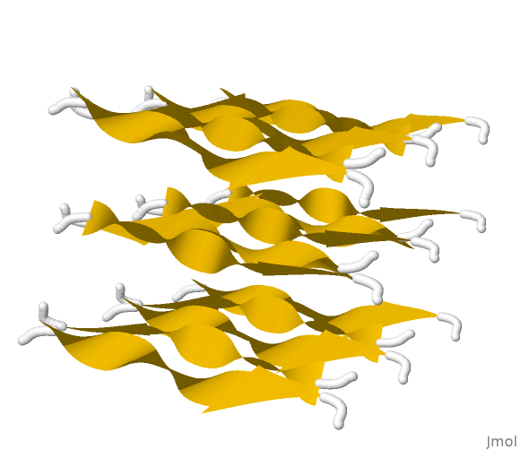
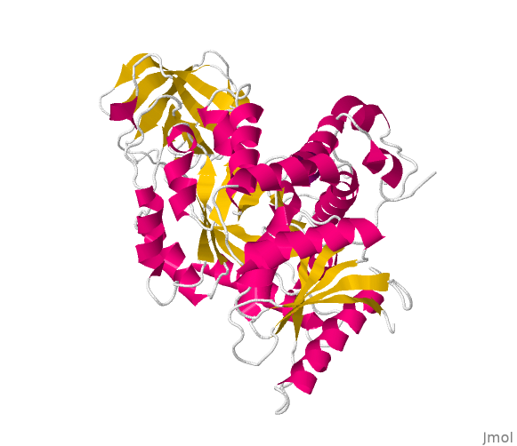
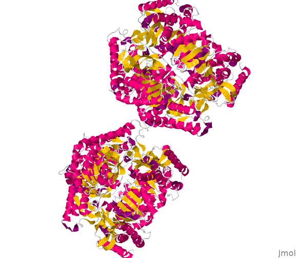
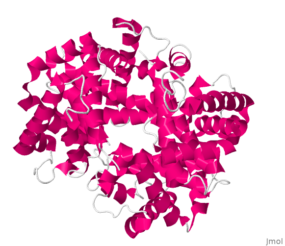
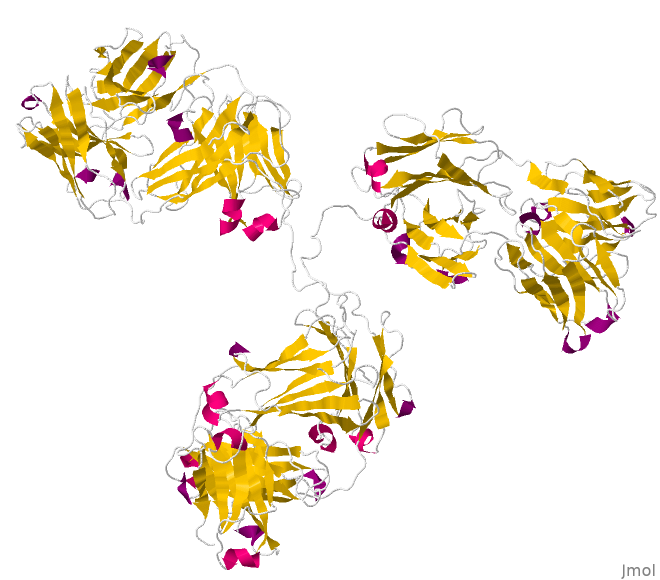
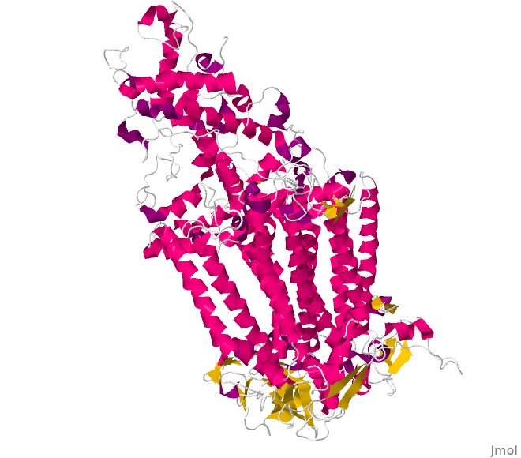
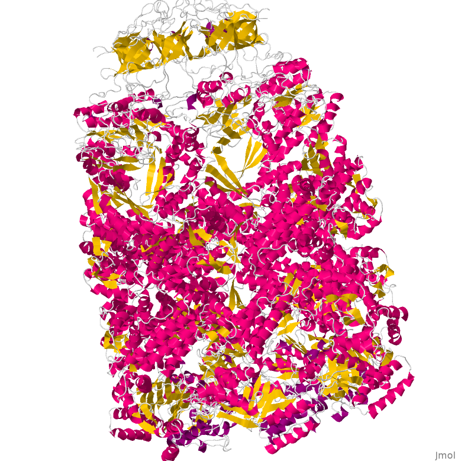

|       Segue abaixo a lista de figuras renderizáveis pelo **Jmol** ordenadas por capítulo do respectivo *ebook*. As figuras estão disponíveis também num único [arquivo comprimido](.\figBook.zip).

## Capítulo 1 - Água ##

{width=5%}  [água](.\h2o.png){target="\_blank"}
{width=5%}  [3 água](.\h2o-3.png){target="\_blank"}
{width=5%}  [5 água](.\h2o-4.png){target="\_blank"}
{width=5%}  [rede de água](.\h2o-tot.png){target="\_blank"}
{width=5%}  [proteína e água](.\hemogl.png){target="\_blank"}

## Capítulo 2 - Aminoácidos ##

{width=5%}  [Gly](.\gly.png){target="\_blank"}
{width=5%}  [Ala](.\ala.png){target="\_blank"}
{width=5%}  [Glu](.\glu.png){target="\_blank"}
{width=5%}  [GABA](.\gaba.png){target="\_blank"}
{width=5%}  [Pro](.\pro.png){target="\_blank"}
{width=5%}  [His](.\his.png){target="\_blank"}
{width=5%}  [histamina](.\histam.png){target="\_blank"}
{width=5%}  [Trp](.\trp.png){target="\_blank"}
{width=5%}  [serotonina](.\serotonine.png){target="\_blank"}
{width=5%}  [Cys](.\cys.png){target="\_blank"}
{width=5%}  [Phe](.\phe.png){target="\_blank"}
{width=5%}  [Tyr](.\tyr.png){target="\_blank"}
{width=5%}  [tiroxina-T4](.\thyroxin.png){target="\_blank"}

## Capítulo 3 - Peptídios ##

{width=5%}  [Ala-Ser](.\AlaSer.png){target="\_blank"}
{width=5%}  [cistina](.\cystine.png){target="\_blank"}
{width=5%}  [Leu-Leu-Ile-Tyr](.\LLIT.png){target="\_blank"}
{width=5%}  [glutationa](.\glutathione.png){target="\_blank"}
{width=5%}  [creatina](.\creatine.png){target="\_blank"}
{width=5%}  [carnitina](.\carnitine.png){target="\_blank"}
{width=5%}  [aspartame](.\aspartame.png){target="\_blank"}
{width=5%}  [tetrapeptídio](.\tetrapep.png){target="\_blank"}

## Capítulo 4 - Proteínas ##

{width=5%}  [alfa-hélice](.\1al1.png){target="\_blank"}
{width=5%}  [1acj-acetil colinesterase](.\1acj.png){target="\_blank"}
{width=5%}  [1lev-frutose-1,6-bifosfatase](.\1lev.png){target="\_blank"}
{width=5%}  [8cat - catalase](.\8cat.png){target="\_blank"}
{width=5%}  [2pec - pectato liase](.\2pec.png){target="\_blank"}
{width=5%}  [2lyz - lisozima](.\2lyz.png){target="\_blank"}
{width=5%}  [1yme - carboxipeptidase (grampo beta)](.\1yme.png){target="\_blank"}
{width=5%}  [1bmw - fibronectina (sanduiche beta)](.\1bmw.png){target="\_blank"}
{width=5%}  [1kt7 - proteína ligadora de retinol](.\1kt7.png){target="\_blank"}
{width=5%}  [3lay - proteína ligadora de zinco (barril alfa)](.\3lay.png){target="\_blank"}
{width=5%}  [1kt7 - proteína ligadora de retinol(barril beta)](.\1kt7.png){target="\_blank"}
{width=5%}  [1lcc - repressor lac (hélice-volta-hélice)](.\1lcc.png){target="\_blank"}
{width=5%}  [1aay - transcrição-DNA (dedo de zinco)](.\1aay.png){target="\_blank"}
{width=5%}  [1ysa - proteína-DNA (zíper de Leu)](.\1ysa.png){target="\_blank"}
{width=5%}  [1cll - calmodulina (mão EF)](.\1cll.png){target="\_blank"}
{width=5%}  [1a2t - nuclease de estafilococo (chave grega)](.\1a2t.png){target="\_blank"}
{width=5%}  [9pap - papaína](.\9pap.png){target="\_blank"}
{width=5%}  [1mbo - mioglobina](.\1mbo.png){target="\_blank"}
{width=5%}  [1cgd - colágeno](.\1cgd.png){target="\_blank"}
{width=5%}  [1slk - fibroína](.\1slk.png){target="\_blank"}
{width=5%}  [1pkm - piruvato quinase](.\1pkm.png){target="\_blank"}
{width=5%}  [1ldn - lactato desidrogenase](.\1ldn.png){target="\_blank"}
{width=5%}  [1emd - succinato desidrogenase](.\1emd.png){target="\_blank"}
{width=5%}  [1thb - hemoglobina](.\1thb.png){target="\_blank"}
{width=5%}  [1igt - imunoglobulina G](.\1igt.png){target="\_blank
{width=5%}  [1prc - fotossistema](.\1prc.png){target="\_blank
{width=5%}  [1aon - chaperonina GroEl](.\1aon.png){target="\_blank
{width=5%}  [1aoi - nucleossomo](.\1aoi.png){target="\_blank
{width=5%}  [1qrs - ribossomo](.\1qrs.png){target="\_blank